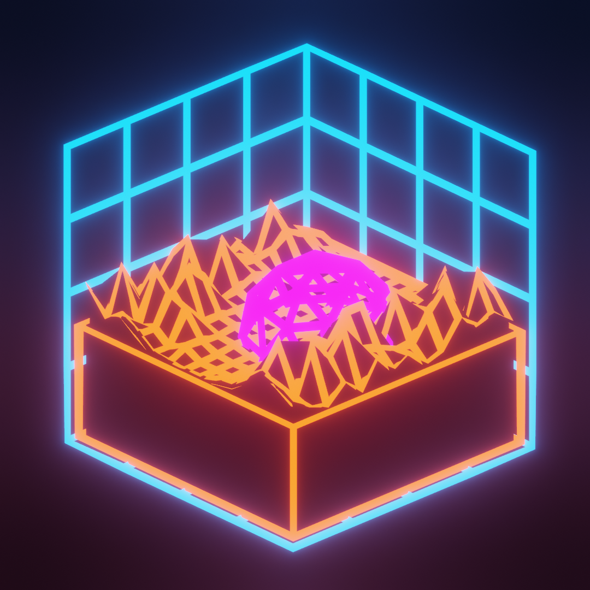

##Retro Land Cake
This blend uses emission shaders with a bloom filter to create a retro synthwave landscape. It's called a land cake because
it shows only a slice of the larger landscape. The camera is set to an orthographic view to keep angles more or less even.
#####
Rendered in Eevee.

